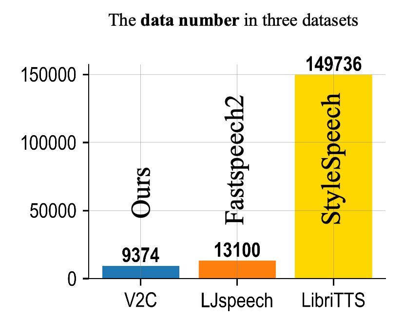
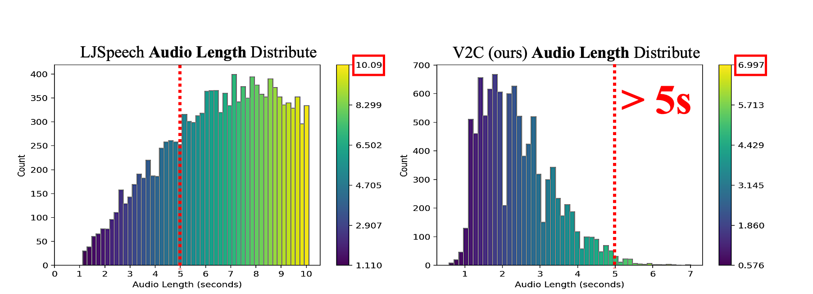
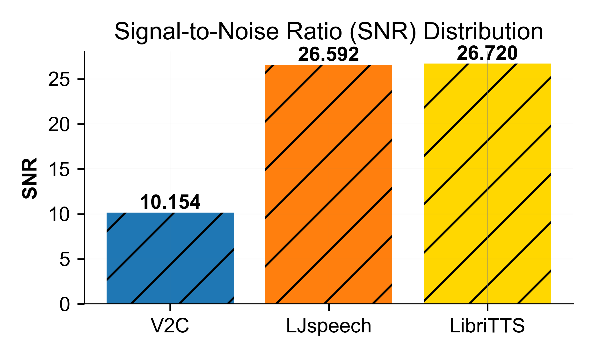
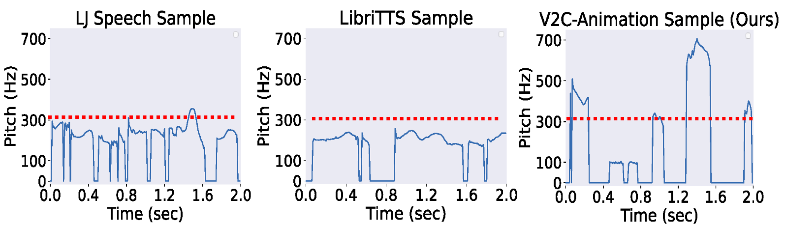

# More-Details-about-the-V2C-Animation-dataset.
V2C is more challenging in the following aspects: (1) V2C is specially used for movie dubbing with emotional visual attributes and multi-speaker identity. (2) The data scale of the V2C dataset is much smaller in terms of either the number of data items or speech length (see Figure 1 (a)-(b)). There are only 9374 video clips in V2C, and most of its audio is shorter than 5s. In contrast, FS2 and Stylespeech are trained on LJspeech and LibriTTS with 13,100 and 149,753 samples with mostly longer than 5s and even more. Although LJspeech also looks relatively small, it is a single-speaker dataset, so V2C allocates very few samples to each speaker. (3) V2C has the largest variance of pitch compared to TTS tasks due to exaggerated expressions of cartoon characters (see Figure 1 (c) and more details in Tab. 2 of V2C-Net). (4) Background noise interference. The audio of V2C contains background noise for the plot, like car whistle, et al. Signal-to-noise Ratio (SNR) of V2C is the lowest (Figure 1 (d)).

